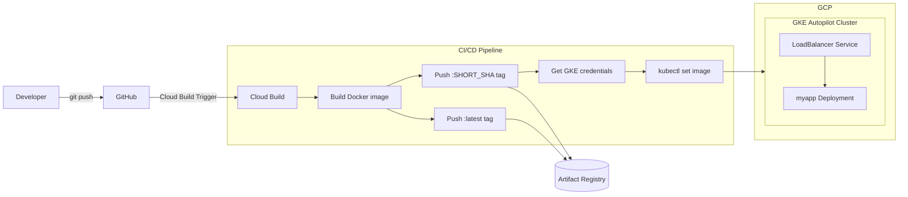

# GKE Autopilot CI/CD Pipeline

A minimal CI/CD pipeline for a containerized app running on **Google Kubernetes Engine (Autopilot)**, built with **Cloud Build** instead of a self-hosted CI server. On every push, Cloud Build builds the image, pushes it to Artifact Registry, and updates the running deployment — no Jenkins, no Terraform, just GCP-native tooling end to end.

This is the earliest project in the series. It's kept intentionally simple, and it's also where a few lessons about version control and reproducibility were learned the hard way — see [Design decisions & known limitations](#design-decisions--known-limitations) below.

---

## Architecture



**Flow summary:**
1. A push to the connected GitHub repository fires a Cloud Build Trigger.
2. Cloud Build builds the Docker image and tags it twice: `:latest` and `:<SHORT_SHA>` — the SHA tag is what actually gets deployed, `:latest` is pushed alongside for convenience/debugging.
3. Both tags are pushed to Artifact Registry.
4. Cloud Build authenticates to the GKE Autopilot cluster and runs `kubectl set image` against the existing `myapp` Deployment, triggering a rolling update.
5. Traffic reaches the app through a `LoadBalancer` Service.

---

## Tech stack

| Layer | Technology |
|---|---|
| Application | Python 3.11, Flask |
| Containerization | Docker |
| CI/CD | Google Cloud Build (trigger-based, no external CI server) |
| Orchestration | Kubernetes (GKE Autopilot) |
| Registry | Google Artifact Registry |

---

## Repository structure

```
.
├── main.py             # Flask app
├── dockerfile           # Container build definition
├── requirements.txt     # flask
├── cloudbuild.yaml       # Build → push → deploy pipeline definition
└── LICENSE
```

> Note: the Kubernetes `Deployment`/`Service` manifests referenced by `cloudbuild.yaml` (`kubectl set image deployment/myapp ...`) are **not** included in this repository — see the limitations section below for why.

---

## Getting started

### Prerequisites
- A GCP project with billing enabled
- A **GKE Autopilot** cluster already created
- Cloud Build, Artifact Registry, and Kubernetes Engine APIs enabled
- The GitHub repository connected to Cloud Build via a Trigger

### 1. Create the Artifact Registry repository
```bash
gcloud artifacts repositories create app-repo \
  --repository-format=docker \
  --location=europe-central2
```

### 2. Bootstrap the Kubernetes objects (one-time, manual)
This pipeline only ever *updates* an existing Deployment — it never creates one. Before the first Cloud Build run, apply an initial Deployment and Service manually, for example:
```bash
kubectl create deployment myapp \
  --image=europe-central2-docker.pkg.dev/<PROJECT_ID>/app-repo/myapp:latest
kubectl expose deployment myapp --type=LoadBalancer --port=80 --target-port=8080
```

### 3. Configure the Cloud Build Trigger
Connect this repository in Cloud Build, point the trigger at `cloudbuild.yaml`, and adjust the substitution variables (`_REGION`, `_REPOSITORY`, `_GKE_CLUSTER`, `_GKE_LOCATION`, etc.) to match your project.

### 4. Push to trigger a deploy
```bash
git push
```
Cloud Build will build the image, push both tags to Artifact Registry, and roll out the new version via `kubectl set image`.

---

## Design decisions & known limitations

This was one of the first projects in this series, and it shows — some of the gaps here directly shaped how the later, more advanced projects were structured.

- **The Kubernetes manifests were never committed to this repository.** During development, the `Deployment` and `Service` were created directly against the cluster with imperative `kubectl` commands (`kubectl create deployment`, `kubectl expose`) rather than being written as YAML and version-controlled. At the time, it wasn't obvious that these belonged in Git alongside the rest of the pipeline — that's a concrete lesson that carried over into the later projects, where every Kubernetes object is defined as a manifest and applied declaratively (`kubectl apply -f` / Kustomize) instead.
- **The `Dockerfile` is named `dockerfile` (lowercase)**, and the `docker build` step in `cloudbuild.yaml` doesn't pass an explicit `-f` flag. On a case-sensitive filesystem (which is what Cloud Build's Linux runners use), Docker's default lookup expects a file named exactly `Dockerfile` — this is worth double-checking before relying on this pipeline again.
- **No IaC for the underlying infrastructure** — the GKE Autopilot cluster and Artifact Registry repository are assumed to already exist and are created manually, unlike the Terraform-driven setups in the other projects in this series.
- **No image tag pinning at rollout time beyond the SHA tag** — deployments are always driven by `kubectl set image`, with no rollback automation if the rollout fails.
- **No health checks, readiness/liveness probes, or resource limits** defined anywhere (since the Deployment itself isn't version-controlled).
- **No image or IaC scanning**, no automated tests in the pipeline.

## Skills demonstrated

GCP-native CI/CD (Cloud Build Triggers, no external CI server) · container image tagging strategy (`:latest` + commit SHA) · Artifact Registry · GKE Autopilot deployment updates via `kubectl set image` · an honest first pass at CI/CD — including recognizing, after the fact, why Kubernetes manifests belong in version control.
